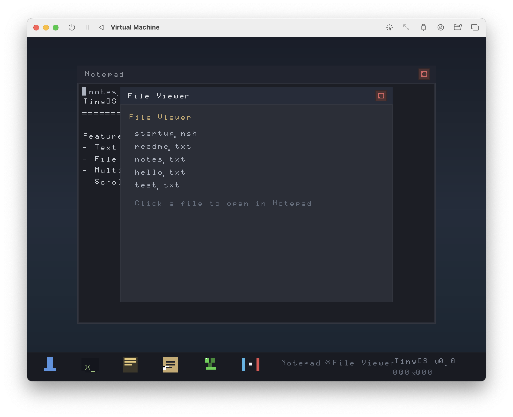

# TinyOS — ARM64 UEFI Native Desktop

A minimal desktop operating system that runs as a native ARM64 UEFI application (PE32+), no Linux kernel required. Boots directly on QEMU/UTM with virtio-gpu framebuffer and UART serial debug.



## Features

- **Native UEFI app** — single PE32+ binary, runs directly on UEFI firmware
- **Framebuffer graphics** — 640×480 via UEFI GOP + virtio-gpu
- **Desktop GUI** — windows, taskbar, draggable titles, close buttons
- **Notepad** — create/edit/save text files via UEFI Simple File System
- **File viewer** — browse and display text files
- **Pong** — classic paddle game with keyboard controls
- **Snake** — classic snake game
- **About dialog** — system info
- **UART debug output** — PL011 MMIO at 0x09000000 for serial tracing

## Requirements

- macOS (or Linux) with ARM64 cross-compiler toolchain
- QEMU (ARM64/UEFI) or UTM
- `aarch64-elf-gcc` (cross-compiler)
- `python3` (build tools)
- ~50 MB free space

## Quick Start

```bash
# Build
cd Tiny-OS
make clean && make

# Create disk image (for file persistence)
make image

# Run with QEMU
qemu-system-aarch64 \
    -machine virt,gic-version=3 \
    -cpu cortex-a72 \
    -m 512M \
    -bios /path/to/QEMU_EFI.fd \
    -serial stdio \
    -drive file=disk.img,format=raw,if=none,id=drive0 \
    -device virtio-blk-pci,drive=drive0 \
    -device virtio-gpu-pci \
    -device virtio-mouse-pci \
    -net none \
    -nodefaults \
    -nographic \
    -device ramfb
```

## Key Bindings

| Key | Action |
|-----|--------|
| Escape | Close window / Exit |
| F1 / F2 / F3 | Open app (see on-screen taskbar) |
| Ctrl+O | Open file (Notepad) |
| Ctrl+S | Save file (Notepad) |
| Arrow keys | Paddle/Pong control |
| WASD | Snake control |

## Project Structure

```
Tiny-OS/
├── Makefile                  # Build system
├── tools/
│   ├── fix_pe.py             # PE32+ post-processing
│   ├── add_reloc.py          # .reloc section generator
│   ├── genfont.py            # Bitmap font generator
│   └── mkimg.py              # Disk image creator
└── src/
    ├── main.c                # Entry point, app loop
    ├── crt0.S                # UEFI CRT startup
    ├── uefi.h                # UEFI protocol definitions
    ├── framebuffer.{c,h}     # Framebuffer driver (GOP + virtio-gpu)
    ├── virtio_gpu.{c,h}      # VirtIO GPU control
    ├── font.{c,h}            # Bitmap font renderer
    ├── font_data.h           # Glyph bitmap data
    ├── input.{c,h}           # Keyboard input
    ├── desktop.{c,h}         # Window manager, taskbar
    ├── fs.{c,h}              # UEFI Simple File System
    ├── notepad.{c,h}         # Text editor app
    ├── snake.{c,h}           # Snake game
    └── pong.{c,h}            # Pong game
```

## Build Dependencies

Install the ARM64 cross-compiler:

```bash
# macOS (Homebrew)
brew install aarch64-elf-gcc aarch64-elf-binutils

# Or build from source (Arm GNU Toolchain)
```

## PE32+ Details

The binary is compiled as a shared ELF, then converted to PEI-AARCH64-LITTLE via objcopy, and post-processed by `tools/fix_pe.py` which:
- Aligns sections to 0x1000
- Fixes the subsystem to EFI_APPLICATION (0x0A)
- Adds a `.reloc` section with base relocations
- Adjusts SizeOfHeaders for EDK2 compatibility
